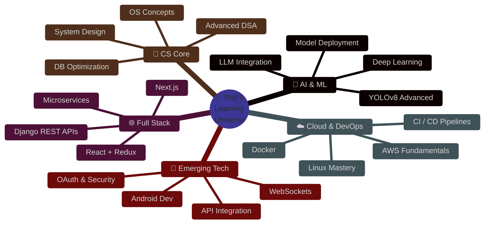

<div align="center">

<!-- ══════════════════════════════════════════════════════════ -->
<!--                  AURORA HERO HEADER                       -->
<!-- ══════════════════════════════════════════════════════════ -->


<br/>

<a href="https://github.com/Yogeshwari7887">

</a>

<br/><br/>

<!-- ✦ Live Status Ribbon ✦ -->
<p>
  
  &nbsp;
  
  &nbsp;
  
  &nbsp;
  
</p>

<br/>

<!-- ✦ Social Links ✦ -->
[](https://github.com/Yogeshwari7887)&nbsp;&nbsp;
[](https://linkedin.com/in/yogeshwari-kalaskar)&nbsp;&nbsp;
[](mailto:yogeshwari7887@gmail.com)&nbsp;&nbsp;
[](https://leetcode.com/Yogeshwari7887)

</div>

---

<!-- ══════════════════════════════════════════════════════════ -->
<!--               WHO IS YOGESHWARI — TERMINAL               -->
<!-- ══════════════════════════════════════════════════════════ -->

<div align="center">
<h2>
  
  &nbsp; The Developer Behind The Code
</h2>
</div>

```python
#!/usr/bin/env python3
# ═══════════════════════════════════════════════════════════════
#   yogeshwari.py  ·  Crafted with ☕ chai & clean code
# ═══════════════════════════════════════════════════════════════

from dataclasses import dataclass, field
from typing import List

@dataclass
class Yogeshwari:
    name       : str = "Yogeshwari Sudhakar Kalaskar"
    alias      : str = "Yogi 🧘"
    based_in   : str = "Pune, Maharashtra, India 🇮🇳"
    education  : str = "B.Tech IT · VIT Pune — CGPA 9.4 / 10 🎓"
    background : str = "Diploma CS · Govt. Polytechnic Jalgaon — 91.49% 🏅"
    status     : str = "Actively seeking SDE / Full-Stack roles 🔍"
    contact    : str = "yogeshwari7887@gmail.com 📬"

    core_stack : List[str] = field(default_factory=lambda: [
        "Python 🐍", "Django 🌐", "React ⚛️", "Flask ⚗️",
        "YOLOv8 🤖", "MySQL 🗃️", "JavaScript ⚡", "PHP 🐘"
    ])

    origin_stories : List[str] = field(default_factory=lambda: [
        "🚦 Built an AI that gives green lights to ambulances in real-time",
        "🌿 Designed an organic e-commerce ecosystem from absolute zero",
        "💙 Created a space where people feel genuinely heard",
        "📚 Scaled from Diploma → 9.4 CGPA in B.Tech — relentlessly",
        "☕ Powered entirely by chai, curiosity & clean architecture",
    ])

    def philosophy(self) -> str:
        return (
            "Build things that matter. "
            "Write code that lasts. "
            "Never stop learning. ✨"
        )

# ─────────────────────────────────────────────────────────────
if __name__ == "__main__":
    me = Yogeshwari()
    print(f"Hello World! I am {me.alias} 👋")
    print(f"Philosophy → {me.philosophy()}")
```

---

<!-- ══════════════════════════════════════════════════════════ -->
<!--            COLORFUL TECH ARSENAL — PREMIUM               -->
<!-- ══════════════════════════════════════════════════════════ -->

<div align="center">

## 🎨 Tech Arsenal

### ◈ Languages


<br/>

### ◈ Frameworks & Frontend


<br/>

### ◈ Tools & Platforms


<br/>

### ◈ AI / Computer Vision


&nbsp;

&nbsp;

&nbsp;


<br/><br/>

</div>

<!-- ✦ Proficiency Matrix ✦ -->
<div align="center">

| ◈ Skill | ░░░░░░░░░░ Power | Tier |
|:--------|:----------------|:----:|
| 🐍 Python | `██████████` 10/10 | 🔥 Expert |
| 🗃️ MySQL / SQL | `█████████░` 9/10 | 🔥 Expert |
| 🌐 HTML5 | `█████████░` 9/10 | 🔥 Expert |
| 🐘 PHP | `████████░░` 8/10 | ⚡ Advanced |
| 🎨 CSS3 | `████████░░` 8/10 | ⚡ Advanced |
| ⚙️ C Language | `████████░░` 8/10 | ⚡ Advanced |
| 🏗️ Django | `███████░░░` 7/10 | 🚀 Proficient |
| 🐙 Git & GitHub | `███████░░░` 7/10 | 🚀 Proficient |
| 🅱️ Bootstrap | `███████░░░` 7/10 | 🚀 Proficient |
| ⚡ JavaScript | `██████░░░░` 6/10 | 📈 Growing |
| ☕ Java & C++ | `██████░░░░` 6/10 | 📈 Growing |
| 🍃 MongoDB | `██████░░░░` 6/10 | 📈 Growing |
| 🤖 YOLOv8 / CV | `████████░░` 8/10 | ⚡ Advanced |

</div>

---

<!-- ══════════════════════════════════════════════════════════ -->
<!--          SIGNATURE PROJECTS — CINEMATIC CARDS            -->
<!-- ══════════════════════════════════════════════════════════ -->

<div align="center">

## 🚀 Signature Projects


</div>

<br/>

---

### 🚦 `[01]` — AI Smart Traffic Management System


&nbsp;

&nbsp;


> *"What if a traffic light could see an ambulance coming and clear the path before it arrives?"*

Built an **end-to-end intelligent traffic system** powered by **YOLOv8** that detects emergency vehicles in real-time via live camera feeds, dynamically reconfigures signal timing, and generates green corridors — potentially saving lives at every intersection.

```
📷 Camera Feed ──▶ YOLOv8 Model ──▶ Signal Controller ──▶ 🟢 GREEN CORRIDOR
                    (92% accuracy)     (real-time sync)       (~40% faster)
```

| Metric | Result |
|--------|--------|
| 🎯 Object Detection Accuracy | **92%** |
| ⚡ Emergency Response Time | **~40% faster** |
| 📡 Signal Coordination | Real-time corridor generation |
| 📊 Dashboard | Live analytics & monitoring |

**Stack:** `YOLOv8` · `Python` · `Flask` · `React` · `OpenCV` · `MySQL`

---

### 🌿 `[02]` — GrowPure: Organic E-Commerce Platform


&nbsp;

&nbsp;


> *"Not just another shop. A complete, breathing business ecosystem."*

A **production-grade organic marketplace** with bulletproof auth, intelligent cart management, promo engine, coupon system, full admin panel, and a silky-smooth responsive UI — architected from scratch.

```
Feature Matrix:
🔐 Auth & Sessions    🛒 Smart Cart        💝 Wishlist
📦 Order Tracking     🏷️ Coupon Engine      💸 Discount Logic
📊 User Dashboard     ⚙️  Admin Panel        📱 Responsive UI
🔍 Product Search     💰 Payment Flow       📧 Email Alerts
```

**Stack:** `Django` · `Python` · `MySQL` · `HTML5` · `CSS3` · `JavaScript` · `Bootstrap`

---

### 💙 `[03]` — YourHearingEar: Personal Counseling Platform


&nbsp;

&nbsp;


> *"Technology can be gentle. Code can be a place where healing begins."*

Designed a **compassionate digital space** where users receive empathetic, structured support. Every design decision was intentional — calm UI, ethical communication patterns, and trust-first architecture.

```
TRUST → EMPATHY → GUIDANCE → ETHICS → Meaningful User Experience
```

**Stack:** `Django` · `Python` · `HTML5` · `CSS3` · `JavaScript`

---

<!-- ══════════════════════════════════════════════════════════ -->
<!--              ANIMATED GITHUB ANALYTICS                    -->
<!-- ══════════════════════════════════════════════════════════ -->

<div align="center">

## 📊 GitHub Analytics

<br/>


&nbsp;


<br/><br/>


&nbsp;&nbsp;


</div>

---

<!-- ══════════════════════════════════════════════════════════ -->
<!--           DSA & COMPETITIVE PROGRAMMING                   -->
<!-- ══════════════════════════════════════════════════════════ -->

<div align="center">

## 🧩 DSA & Competitive Programming


<br/><br/>

[](https://leetcode.com/Yogeshwari7887)&nbsp;
[](https://www.codechef.com/users/yogeshwari7887)&nbsp;
[](https://www.hackerrank.com/yogeshwari7887)&nbsp;
[](https://codeforces.com/profile/yogeshwari7887)&nbsp;
[](https://www.geeksforgeeks.org/user/yogeshwari7887)

<br/>

```
╔═══════════════════════════════════════════════════════════════════╗
║  🏆  COMPETITIVE PROGRAMMING ARENA                                ║
╠══════════════════╦═══════════════════════════════╦════════════════╣
║  🟡  LeetCode    ║  DSA · Algorithms · Daily      ║  ● ACTIVE      ║
╠══════════════════╬═══════════════════════════════╬════════════════╣
║  🟤  CodeChef    ║  Competitive Programming       ║  ● ACTIVE      ║
╠══════════════════╬═══════════════════════════════╬════════════════╣
║  🟢  HackerRank  ║  Python · SQL · Certified      ║  ● ACTIVE      ║
╠══════════════════╬═══════════════════════════════╬════════════════╣
║  🔵  Codeforces  ║  Algo · Problem Sets           ║  ● ACTIVE      ║
╠══════════════════╬═══════════════════════════════╬════════════════╣
║  🟩  GFG         ║  CS Fundamentals · Arrays      ║  ● ACTIVE      ║
╚══════════════════╩═══════════════════════════════╩════════════════╝
```

</div>

---

<!-- ══════════════════════════════════════════════════════════ -->
<!--              LEARNING ROADMAP — MINDMAP                   -->
<!-- ══════════════════════════════════════════════════════════ -->

<div align="center">

## 📡 Current Learning Orbit

</div>



<div align="center">

<br/>


&nbsp;

&nbsp;

&nbsp;


</div>

---

<!-- ══════════════════════════════════════════════════════════ -->
<!--          ACHIEVEMENTS & MILESTONES — TROPHY ROW           -->
<!-- ══════════════════════════════════════════════════════════ -->

<div align="center">

## 🏆 Achievements & Milestones


<br/>

</div>

<table align="center" width="100%">
<tr>
<td align="center" width="20%">

🎓
**9.4 / 10**
B.Tech IT
VIT Pune

</td>
<td align="center" width="20%">

🏅
**91.49%**
Diploma CS
Govt. Polytechnic

</td>
<td align="center" width="20%">

🤖
**92% Acc.**
YOLOv8 AI
Traffic System

</td>
<td align="center" width="20%">

⚡
**~40% Faster**
Emergency
Response Time

</td>
<td align="center" width="20%">

💼
**7 Weeks**
Industry Training
Passion Software

</td>
</tr>
<tr>
<td align="center">

🌐
**3 Projects**
Live Full-Stack
Applications

</td>
<td align="center">

🛠️
**10+ Skills**
Languages
& Frameworks

</td>
<td align="center">

🧩
**500+ DSA**
Problems Solved
5 Platforms

</td>
<td align="center">

🎯
**Full-Stack**
Frontend + Backend
+ AI Systems

</td>
<td align="center">

📍
**Pune, India**
Building the
Future from Here

</td>
</tr>
</table>

---

<!-- ══════════════════════════════════════════════════════════ -->
<!--               EXPERIENCE TIMELINE                         -->
<!-- ══════════════════════════════════════════════════════════ -->

<div align="center">

## 💼 Journey Timeline

</div>

```
────────────────────────────────────────────────────────────── ▶ Future ∞
2021          2024          2025          2026         2028
  │             │             │             │             │
  │  📘 Diploma  │  🏢 Training │  💙 Platform │  🚦 AI System │  🎓 B.Tech
  │  Comp. Engg  │  Passion SW  │  YourHearing │  Traffic MGMT │  Graduation
  │  91.49% 🏅  │  7 Weeks ✔   │  Ear ✔ Sep  │  YOLOv8 ✔ Jan│  CGPA 9.4 ⭐
  │  Jalgaon     │  Django+React│              │  92% Accuracy │  VIT Pune
  │              │  Full Stack  │              │  ~40% faster  │
────────────────────────────────────────────────────────────── ▶ Future ∞
```

---

<!-- ══════════════════════════════════════════════════════════ -->
<!--             CONTRIBUTION ACTIVITY GRAPH                   -->
<!-- ══════════════════════════════════════════════════════════ -->

<div align="center">

## 📈 Contribution Activity


<br/>


</div>

---

<!-- ══════════════════════════════════════════════════════════ -->
<!--              PREMIUM CONTACT / CTA SECTION                -->
<!-- ══════════════════════════════════════════════════════════ -->

<div align="center">

## 🤝 Let's Build Something That Matters


<br/><br/>

<a href="mailto:yogeshwari7887@gmail.com">
  
</a>

<br/><br/>

<a href="https://github.com/Yogeshwari7887">
  
</a>
&nbsp;&nbsp;
<a href="https://linkedin.com/in/yogeshwari-kalaskar">
  
</a>

<br/><br/>


&nbsp;

&nbsp;


</div>

<br/>

---

<!-- ══════════════════════════════════════════════════════════ -->
<!--             SNAKE ANIMATION + FOOTER CLOSE                -->
<!-- ══════════════════════════════════════════════════════════ -->

<div align="center">


<br/>


<br/><br/>


<br/>


</div>
