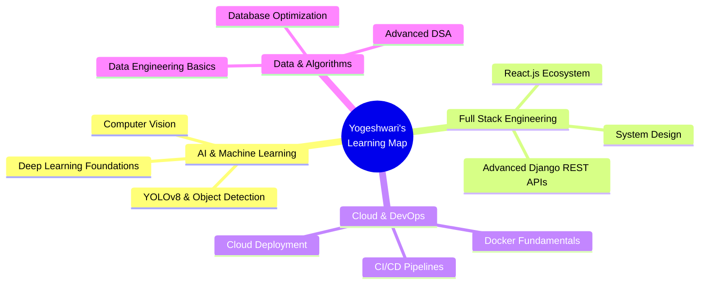

<div align="center">

<!-- ═══════════════════════════════════════════════════════════════ -->
<!--                        HERO BANNER                            -->
<!-- ═══════════════════════════════════════════════════════════════ -->


<!-- Typing Animation -->
<a href="https://github.com/Yogeshwari7887">
  
</a>

<br/>

<!-- Profile Views & Social Badges -->
<p>
  
  &nbsp;
  <a href="https://github.com/Yogeshwari7887?tab=followers">
    
  </a>
  &nbsp;
  
  &nbsp;
  
</p>

<br/>

</div>

---

<!-- ═══════════════════════════════════════════════════════════════ -->
<!--                      INTRODUCTION                             -->
<!-- ═══════════════════════════════════════════════════════════════ -->

<div align="center">
  
  <h2><b>Hello World! I'm Yogeshwari</b></h2>
</div>

```python
class Yogeshwari:
    """Full Stack Developer | Python Engineer | AI Enthusiast"""
    
    def __init__(self):
        self.name        = "Yogeshwari Sudhakar Kalaskar"
        self.location    = "Pune, Maharashtra, India 🇮🇳"
        self.education   = "B.Tech IT @ VIT Pune (CGPA: 9.4/10)"
        self.role        = ["Full Stack Developer", "Python Developer"]
        self.passion     = "Building intelligent, scalable software"
        self.email       = "yogeshwari7887@gmail.com"

    def current_focus(self):
        return [
            "🤖 AI-Powered Applications",
            "🌐 Full Stack Web Development",
            "📦 Scalable Backend Systems",
            "🧠 Problem Solving & DSA",
        ]

    def life_philosophy(self):
        return "Code is poetry — write it beautifully. ✨"

me = Yogeshwari()
print(me.life_philosophy())
```

<br/>

---

<!-- ═══════════════════════════════════════════════════════════════ -->
<!--                   PROFESSIONAL SUMMARY                        -->
<!-- ═══════════════════════════════════════════════════════════════ -->

<div align="center">
  <h2>🎯 Professional Summary</h2>
</div>

<table>
<tr>
<td width="50%">

### 🚀 Who Am I?

A passionate **B.Tech Information Technology** student at **Vishwakarma Institute of Technology, Pune**, with a CGPA of **9.4/10**. I design and build production-ready web applications, intelligent AI systems, and scalable backend solutions.

With a strong foundation from my **Diploma in Computer Engineering (91.49%)** and hands-on training at **Passion Software Solutions Pvt. Ltd.**, I blend academic rigor with real-world engineering.

</td>
<td width="50%">

### 🌱 What Drives Me?

- 💡 Building real-world, impactful applications
- 🤖 Exploring the intersection of AI & Web Dev
- 📚 Continuously sharpening my engineering skills
- 🤝 Collaborating on open-source & team projects
- 🎯 Writing clean, maintainable, production-grade code

> *"From 91.49% Diploma to 9.4 CGPA B.Tech — growth is the goal."*

</td>
</tr>
</table>

<br/>

---

<!-- ═══════════════════════════════════════════════════════════════ -->
<!--                       TECH STACK                              -->
<!-- ═══════════════════════════════════════════════════════════════ -->

<div align="center">
  <h2>🛠️ Tech Stack & Arsenal</h2>
  
  <br/><br/>
  
  <br/><br/>
  
</div>

<br/>

<div align="center">

**Languages**


**Frameworks & Tools**


</div>

<br/>

---

<!-- ═══════════════════════════════════════════════════════════════ -->
<!--                    FEATURED PROJECTS                          -->
<!-- ═══════════════════════════════════════════════════════════════ -->

<div align="center">
  <h2>🚀 Featured Projects</h2>
</div>

<table>
<tr>
<td width="33%" valign="top">

### 🚦 AI Smart Traffic System
**`Jan 2026`**

> Intelligent traffic control detecting emergency vehicles via **YOLOv8 computer vision** and generating green corridors in real time.

**Key Highlights:**
- 🎯 **92% detection accuracy**
- ⚡ **40% faster** emergency response
- 📡 Real-time signal synchronization
- 📊 Traffic analytics dashboard

**Stack:**
`YOLOv8` `Python` `Flask` `React` `OpenCV`

</td>
<td width="33%" valign="top">

### 🌿 GrowPure — Organic E-Commerce
**`Full Stack`**

> Production-grade organic e-commerce platform with complete business workflows, admin controls, and responsive UX.

**Key Highlights:**
- 🔐 Secure authentication system
- 🛒 Cart, wishlist & coupons
- 📦 Order tracking & dashboards
- 🎨 Fully responsive design

**Stack:**
`Django` `Python` `MySQL` `JS` `Bootstrap`

</td>
<td width="33%" valign="top">

### 💙 YourHearingEar — Counseling Platform
**`Sep 2025`**

> A compassionate digital environment for supportive guidance, empathetic communication, and meaningful user interactions.

**Key Highlights:**
- 🧭 Structured guidance system
- 💬 Conversational support flow
- 🤝 Ethics-first design
- 🛡️ Trust-centered architecture

**Stack:**
`Django` `Python` `HTML` `CSS` `JavaScript`

</td>
</tr>
</table>

<br/>

---

<!-- ═══════════════════════════════════════════════════════════════ -->
<!--                     GITHUB STATS                              -->
<!-- ═══════════════════════════════════════════════════════════════ -->

<div align="center">
  <h2>📊 GitHub Stats</h2>
</div>

<div align="center">
  
  &nbsp;
  
</div>

<br/>

<div align="center">
  
</div>

<br/>

---

<!-- ═══════════════════════════════════════════════════════════════ -->
<!--                  DSA & CODING PROFILES                        -->
<!-- ═══════════════════════════════════════════════════════════════ -->

<div align="center">
  <h2>🧩 DSA & Coding Profiles</h2>
</div>

<div align="center">
  <a href="https://leetcode.com/Yogeshwari7887" target="_blank">
    
  </a>
  &nbsp;
  <a href="https://www.codechef.com/users/yogeshwari7887" target="_blank">
    
  </a>
  &nbsp;
  <a href="https://www.hackerrank.com/yogeshwari7887" target="_blank">
    
  </a>
  &nbsp;
  <a href="https://codeforces.com/profile/yogeshwari7887" target="_blank">
    
  </a>
  &nbsp;
  <a href="https://www.geeksforgeeks.org/user/yogeshwari7887" target="_blank">
    
  </a>
</div>

<br/>

<div align="center">

| Platform | Focus Area | Status |
|----------|------------|--------|
| 🟡 LeetCode | Data Structures & Algorithms | Active |
| 🟤 CodeChef | Competitive Programming | Active |
| 🟢 HackerRank | Python & SQL Challenges | Active |
| 🔵 Codeforces | Algorithmic Problem Solving | Active |
| 🟩 GeeksforGeeks | CS Fundamentals & Practice | Active |

</div>

<br/>

---

<!-- ═══════════════════════════════════════════════════════════════ -->
<!--                    CURRENT LEARNING                           -->
<!-- ═══════════════════════════════════════════════════════════════ -->

<div align="center">
  <h2>📚 Currently Learning & Exploring</h2>
</div>



<br/>

<div align="center">
  
  
  
  
  
</div>

<br/>

---

<!-- ═══════════════════════════════════════════════════════════════ -->
<!--                      ACHIEVEMENTS                             -->
<!-- ═══════════════════════════════════════════════════════════════ -->

<div align="center">
  <h2>🏆 Achievements & Milestones</h2>
</div>

<div align="center">
  
</div>

<br/>

<table align="center">
<tr>
<td align="center" width="25%">
  
  <br/><b>9.4 CGPA</b>
  <br/><sub>B.Tech IT @ VIT Pune</sub>
</td>
<td align="center" width="25%">
  
  <br/><b>91.49%</b>
  <br/><sub>Diploma in CS Engg.</sub>
</td>
<td align="center" width="25%">
  
  <br/><b>92% Accuracy</b>
  <br/><sub>YOLOv8 AI Traffic System</sub>
</td>
<td align="center" width="25%">
  
  <br/><b>40% Faster</b>
  <br/><sub>Emergency Response Time</sub>
</td>
</tr>
<tr>
<td align="center" width="25%">
  
  <br/><b>7-Week Training</b>
  <br/><sub>Full Stack @ Passion Software</sub>
</td>
<td align="center" width="25%">
  
  <br/><b>3 Live Projects</b>
  <br/><sub>Real-world applications built</sub>
</td>
<td align="center" width="25%">
  
  <br/><b>7+ Technologies</b>
  <br/><sub>Languages mastered</sub>
</td>
<td align="center" width="25%">
  
  <br/><b>AI Integration</b>
  <br/><sub>CV + Web + Real-time systems</sub>
</td>
</tr>
</table>

<br/>

---

<!-- ═══════════════════════════════════════════════════════════════ -->
<!--                     ACTIVITY GRAPH                            -->
<!-- ═══════════════════════════════════════════════════════════════ -->

<div align="center">
  <h2>📈 Contribution Activity</h2>
</div>

<div align="center">
  
</div>

<br/>

---

<!-- ═══════════════════════════════════════════════════════════════ -->
<!--                     INDUSTRY TRAINING                         -->
<!-- ═══════════════════════════════════════════════════════════════ -->

<div align="center">
  <h2>💼 Industry Experience</h2>
</div>

<div align="center">

```
┌──────────────────────────────────────────────────────────┐
│         PASSION SOFTWARE SOLUTIONS PVT. LTD.             │
│              Full Stack Python Trainee                   │
│                  June 2024 | 7 Weeks                     │
├──────────────────────────────────────────────────────────┤
│  ✦ Python & Django Backend Engineering                   │
│  ✦ Responsive Frontend: HTML, CSS, Bootstrap, JS         │
│  ✦ Version Control: Git & GitHub Workflows               │
│  ✦ Industry-Standard Development Practices               │
│  ✦ End-to-End Web Application Deployment                 │
└──────────────────────────────────────────────────────────┘
```

</div>

<br/>

---

<!-- ═══════════════════════════════════════════════════════════════ -->
<!--                      CONTACT LINKS                            -->
<!-- ═══════════════════════════════════════════════════════════════ -->

<div align="center">
  <h2>🤝 Let's Connect & Collaborate</h2>
  <p><i>Open to internships, collaborations, and exciting opportunities!</i></p>
</div>

<div align="center">

[](mailto:yogeshwari7887@gmail.com)
&nbsp;
[](https://github.com/Yogeshwari7887)
&nbsp;
[](https://linkedin.com/in/yogeshwari-kalaskar)

</div>

<br/>

<div align="center">
  
</div>

<div align="center">
  <table>
  <tr>
  <td align="center">📍 Pune, Maharashtra, India</td>
  <td align="center">🎓 VIT Pune — B.Tech IT</td>
  <td align="center">✉️ yogeshwari7887@gmail.com</td>
  <td align="center">💼 Open to Opportunities</td>
  </tr>
  </table>
</div>

<br/>

---

<!-- ═══════════════════════════════════════════════════════════════ -->
<!--                         FOOTER                                -->
<!-- ═══════════════════════════════════════════════════════════════ -->

<div align="center">

 
**Thank you for visiting my profile!**


<br/>

*"Building scalable web applications and intelligent software solutions*  
*through clean architecture, modern technologies, and continuous learning."*

<br/>


<br/>


</div>
