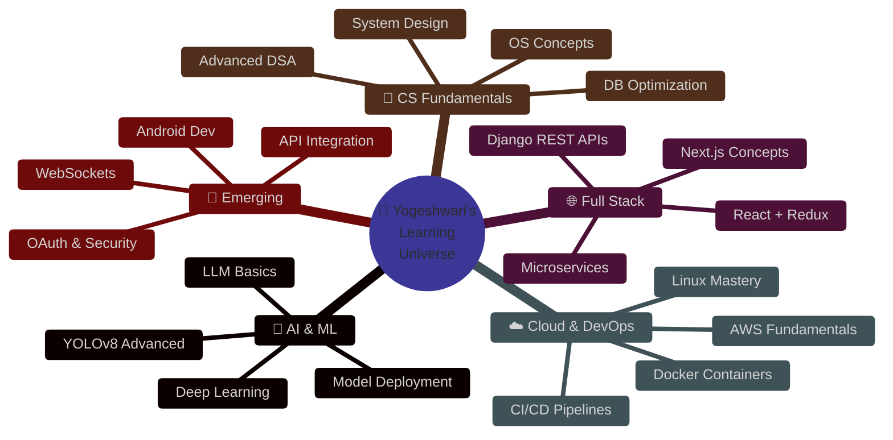

<div align="center">

<!-- ╔══════════════════════════════════════════════════════════════════╗ -->
<!--                    CINEMATIC HERO SECTION                          -->
<!-- ╚══════════════════════════════════════════════════════════════════╝ -->


<br/>

<!-- Particle / Matrix typing animation -->
<a href="https://github.com/Yogeshwari7887">

</a>

<br/><br/>

<!-- Live status badges row -->
<p>

&nbsp;

&nbsp;

&nbsp;

</p>

<br/>

<!-- Animated social row -->
[](https://github.com/Yogeshwari7887)
[](mailto:yogeshwari7887@gmail.com)
[](https://linkedin.com/in/yogeshwari-kalaskar)
[](https://leetcode.com/Yogeshwari7887)

</div>

---

<!-- ╔══════════════════════════════════════════════════════════════════╗ -->
<!--                  ANIMATED INTRODUCTION TERMINAL                    -->
<!-- ╚══════════════════════════════════════════════════════════════════╝ -->

<div align="center">
<h2>
  
  &nbsp;Who is Yogeshwari?
</h2>
</div>

```python
#!/usr/bin/env python3
# ============================================================
#  yogeshwari.py — The Developer Behind The Code
# ============================================================

from dataclasses import dataclass, field
from typing import List

@dataclass
class Developer:
    name:       str = "Yogeshwari Sudhakar Kalaskar"
    alias:      str = "Yogi 🧘"
    location:   str = "Pune, Maharashtra, India 🇮🇳"
    education:  str = "B.Tech IT @ VIT Pune (CGPA 9.4 / 10.0) 🎓"
    diploma:    str = "Computer Engg. @ Govt. Polytechnic Jalgaon (91.49%) 🏅"
    status:     str = "Actively seeking SDE / Full-Stack Internship 🔍"
    contact:    str = "yogeshwari7887@gmail.com 📧"

    languages:  List[str] = field(default_factory=lambda: [
        "Python 🐍", "PHP 🐘", "SQL 🗃️", "JavaScript ⚡",
        "C", "C++", "Java ☕"
    ])

    superpowers: List[str] = field(default_factory=lambda: [
        "🤖 AI + Computer Vision (YOLOv8)",
        "🌐 Full Stack Web (Django + React)",
        "⚙️  Scalable Backend Engineering",
        "📊 Database Design & Optimization",
        "🧠 Algorithmic Problem Solving",
    ])

    fun_facts: List[str] = field(default_factory=lambda: [
        "🚦 Built an AI that gives green lights to ambulances",
        "🌿 Created an organic marketplace from scratch",
        "💙 Designed a platform where people feel heard",
        "📚 Went from Diploma to 9.4 CGPA in B.Tech",
        "☕ Runs on chai, curiosity, and clean code",
    ])

    def life_mantra(self) -> str:
        return (
            "Build things that matter. "
            "Write code that lasts. "
            "Never stop learning. ✨"
        )

if __name__ == "__main__":
    me = Developer()
    print(f"Hello, World! I'm {me.alias}")
    print(f"Mantra → {me.life_mantra()}")
    # Output:
    # Hello, World! I'm Yogi 🧘
    # Mantra → Build things that matter. Write code that lasts. Never stop learning. ✨
```

<br/>

---

<!-- ╔══════════════════════════════════════════════════════════════════╗ -->
<!--                    ANIMATED TECH ARSENAL                           -->
<!-- ╚══════════════════════════════════════════════════════════════════╝ -->

<div align="center">

## 🛠️ Tech Arsenal

<!-- Row 1: Languages -->
&nbsp;
&nbsp;
&nbsp;
&nbsp;
&nbsp;
&nbsp;


<br/><br/>

<!-- Row 2: Backend -->
&nbsp;
&nbsp;
&nbsp;
&nbsp;
&nbsp;


<br/><br/>

<!-- Row 3: Tools -->
&nbsp;
&nbsp;
&nbsp;
&nbsp;
&nbsp;


</div>

<br/>

<!-- Proficiency bars as animated progress images -->
<div align="center">

| 🔤 Skill | Proficiency | Level |
|:---------|:------------|:-----:|
| Python | `█████████░` 9/10 | 🔥 Expert |
| MySQL / SQL | `█████████░` 9/10 | 🔥 Expert |
| HTML | `█████████░` 9/10 | 🔥 Expert |
| PHP | `████████░░` 8/10 | ⚡ Advanced |
| CSS | `████████░░` 8/10 | ⚡ Advanced |
| C | `████████░░` 8/10 | ⚡ Advanced |
| Django | `███████░░░` 7/10 | 🚀 Proficient |
| Git & GitHub | `███████░░░` 7/10 | 🚀 Proficient |
| Bootstrap | `███████░░░` 7/10 | 🚀 Proficient |
| JavaScript | `██████░░░░` 6/10 | 📈 Growing |
| Java & C++ | `██████░░░░` 6/10 | 📈 Growing |
| MongoDB | `██████░░░░` 6/10 | 📈 Growing |

</div>

<br/>

---

<!-- ╔══════════════════════════════════════════════════════════════════╗ -->
<!--              CINEMATIC FEATURED PROJECTS                           -->
<!-- ╚══════════════════════════════════════════════════════════════════╝ -->

<div align="center">

## 🚀 Signature Projects


</div>

<br/>

<!-- PROJECT 1 -->
<table>
<tr>
<td>

### 🚦 `PROJECT_01` — AI Smart Traffic Management System


> *"What if traffic lights could think?"* — This project answers that question.

Engineered an **end-to-end intelligent traffic control system** that detects emergency vehicles in real time using **YOLOv8 computer vision**, dynamically reconfigures signal timing, and carves green corridors — potentially saving lives at every intersection.

```
                    📷 Camera Feed
                         │
                    ┌────▼─────┐
                    │ YOLOv8   │ ─── 92% detection accuracy
                    │  Model   │
                    └────┬─────┘
                         │  Emergency Vehicle Detected
                    ┌────▼──────────────┐
                    │  Signal Controller │ ─── Dynamic re-timing
                    └────┬──────────────┘
                         │
              ┌──────────┴──────────┐
         🟢 GREEN               🔴 HOLD
       (Emergency Path)      (Cross Traffic)
              │
         ⏱️ ~40% faster response time
```

**Measured Impact:**
| Metric | Result |
|--------|--------|
| 🎯 Detection Accuracy | **92%** |
| ⚡ Response Time Improvement | **~40% faster** |
| 📡 Signal Sync | Real-time corridor generation |
| 📊 Dashboard | Live analytics & monitoring |

**Stack:** `YOLOv8` `Python` `Flask` `React` `OpenCV` `Computer Vision`

</td>
</tr>
</table>

<br/>

<!-- PROJECT 2 -->
<table>
<tr>
<td>

### 🌿 `PROJECT_02` — GrowPure: Organic E-Commerce Platform


> *"Not just another e-commerce — a complete business ecosystem."*

A **production-grade organic marketplace** architected from zero, featuring bulletproof authentication, intelligent cart management, promo engine, and admin superpowers — all wrapped in a silky-smooth responsive UI.

**Feature Matrix:**

```
🔐 Auth System      🛒 Shopping Cart     💝 Wishlist
📦 Order Tracking   🏷️ Coupon Engine      💸 Discount Mgmt
📊 User Dashboard   ⚙️  Admin Panel        📱 Responsive UI
🔍 Product Search   💰 Payment Flow       📧 Email Notifications
```

**Architecture Snapshot:**
```
Django Backend ←→ MySQL DB
      │
  ┌───┴────────────────────────────┐
  │   Admin    User    Product     │
  │   Views    Auth    Catalog     │
  └───┬────────────────────────────┘
      │
 Bootstrap + Vanilla JS Frontend
```

**Stack:** `Django` `Python` `MySQL` `HTML5` `CSS3` `JavaScript` `Bootstrap`

</td>
</tr>
</table>

<br/>

<!-- PROJECT 3 -->
<table>
<tr>
<td>

### 💙 `PROJECT_03` — YourHearingEar: Personal Counseling Platform


> *"Technology can be gentle. Code can heal."*

Designed a **compassionate digital space** where users receive empathetic, structured support. Every design decision was intentional — from the calm color palette to ethical communication patterns that build genuine trust.

**Core Philosophy pillars:**
```
  TRUST        EMPATHY      GUIDANCE      ETHICS
    │              │             │           │
    └──────────────┴─────────────┴───────────┘
                        │
              YourHearingEar Platform
                        │
              Meaningful User Experience
```

**Stack:** `Django` `Python` `HTML5` `CSS3` `JavaScript`

</td>
</tr>
</table>

<br/>

---

<!-- ╔══════════════════════════════════════════════════════════════════╗ -->
<!--                   ANIMATED GITHUB STATS                            -->
<!-- ╚══════════════════════════════════════════════════════════════════╝ -->

<div align="center">

## 📊 GitHub Analytics

<br/>


&nbsp;


<br/><br/>


&nbsp;&nbsp;


</div>

<br/>

---

<!-- ╔══════════════════════════════════════════════════════════════════╗ -->
<!--                   DSA & CODING PROFILES                            -->
<!-- ╚══════════════════════════════════════════════════════════════════╝ -->

<div align="center">

## 🧩 DSA & Competitive Programming


<br/>

[](https://leetcode.com/Yogeshwari7887)
[](https://www.codechef.com/users/yogeshwari7887)
[](https://www.hackerrank.com/yogeshwari7887)
[](https://codeforces.com/profile/yogeshwari7887)
[](https://www.geeksforgeeks.org/user/yogeshwari7887)

<br/><br/>

```
╔═══════════════════════════════════════════════════════════╗
║              🏆 COMPETITIVE PROGRAMMING ARENA             ║
╠═══════════════╦═══════════════════════════╦═══════════════╣
║ 🟡 LeetCode   ║ DSA · Algo · Daily Grind  ║    Active     ║
╠═══════════════╬═══════════════════════════╬═══════════════╣
║ 🟤 CodeChef   ║ Competitive Programming   ║    Active     ║
╠═══════════════╬═══════════════════════════╬═══════════════╣
║ 🟢 HackerRank ║ Python · SQL · Certified  ║    Active     ║
╠═══════════════╬═══════════════════════════╬═══════════════╣
║ 🔵 Codeforces ║ Algorithmic Problem Sets  ║    Active     ║
╠═══════════════╬═══════════════════════════╬═══════════════╣
║ 🟩 GFG        ║ CS Fundamentals · Arrays  ║    Active     ║
╚═══════════════╩═══════════════════════════╩═══════════════╝
```

</div>

<br/>

---

<!-- ╔══════════════════════════════════════════════════════════════════╗ -->
<!--                    CURRENT LEARNING ROADMAP                        -->
<!-- ╚══════════════════════════════════════════════════════════════════╝ -->

<div align="center">

## 📚 Current Learning Orbit

</div>



<div align="center">

<br/>


</div>

<br/>

---

<!-- ╔══════════════════════════════════════════════════════════════════╗ -->
<!--                   ACHIEVEMENTS & MILESTONES                        -->
<!-- ╚══════════════════════════════════════════════════════════════════╝ -->

<div align="center">

## 🏆 Achievements & Milestones


<br/>

</div>

<!-- Achievement cards grid -->
<table align="center">
<tr>
<td align="center" width="20%">

**🎓**
<br/>**9.4 CGPA**
<br/>B.Tech IT
<br/>VIT Pune

</td>
<td align="center" width="20%">

**🏅**
<br/>**91.49%**
<br/>Diploma CS
<br/>Govt. Polytechnic

</td>
<td align="center" width="20%">

**🤖**
<br/>**92% Accuracy**
<br/>YOLOv8 AI
<br/>Traffic System

</td>
<td align="center" width="20%">

**⚡**
<br/>**-40% Time**
<br/>Emergency
<br/>Response Speed

</td>
<td align="center" width="20%">

**💼**
<br/>**7 Weeks**
<br/>Industry Training
<br/>Passion Software

</td>
</tr>
<tr>
<td align="center">

**🌐**
<br/>**3 Projects**
<br/>Full-Stack
<br/>Live Applications

</td>
<td align="center">

**🛠️**
<br/>**10+ Skills**
<br/>Languages
<br/>& Frameworks

</td>
<td align="center">

**🧩**
<br/>**Multi-Platform**
<br/>DSA Grinder
<br/>5 Platforms

</td>
<td align="center">

**🎯**
<br/>**Full-Stack**
<br/>Frontend + Backend
<br/>+ AI Systems

</td>
<td align="center">

**📍**
<br/>**Pune, India**
<br/>Building the
<br/>Future from Here

</td>
</tr>
</table>

<br/>

---

<!-- ╔══════════════════════════════════════════════════════════════════╗ -->
<!--                  INDUSTRY TRAINING TIMELINE                        -->
<!-- ╚══════════════════════════════════════════════════════════════════╝ -->

<div align="center">

## 💼 Experience Timeline

</div>

```
2021 ──────────────────────────────────────────────────────── 2028
  │                                                              │
  │  📘 Diploma in Computer Engineering                          │
  │  Government Polytechnic Jalgaon                             │
  │  3 Years | Final: 91.49% 🏅                                 │
  │  [Programming · DB · Web Tech · Software Dev]               │
  │                                                              │
  │━━━━━━━━━━━━━━━━━━━━━━━━━━━━━━━━━━━━━━━━━━━━━━━━━━━━━━━━━━━━│
  │                                                              │
  │  🎓 B.Tech Information Technology — ONGOING (2028)          │
  │  Vishwakarma Institute of Technology, Pune                  │
  │  Current CGPA: 9.4 / 10.0 ⭐                               │
  │  [Full Stack · AI Apps · Systems · Software Engg.]          │
  │                                                              │
  │━━━━━━━━━━━━━━━━━━━━━━━━━━━━━━━━━━━━━━━━━━━━━━━━━━━━━━━━━━━━│
  │                                                              │
  │  🏢 INDUSTRY TRAINING — June 2024 (7 Weeks)                 │
  │  Passion Software Solutions Pvt. Ltd.                       │
  │  Role: Full Stack Python Trainee                            │
  │  ✓ Django · Python · HTML/CSS/JS · Bootstrap               │
  │  ✓ Git & GitHub · Industry Workflows · Deployment          │
  │                                                              │
  │━━━━━━━━━━━━━━━━━━━━━━━━━━━━━━━━━━━━━━━━━━━━━━━━━━━━━━━━━━━━│
  │                                                              │
  │  🚦 Project: AI Traffic Management — Jan 2026               │
  │  💙 Project: YourHearingEar — Sep 2025                      │
  │  🌿 Project: GrowPure E-Commerce — Ongoing                  │
  │                                                              │
  └──────────────────────────────────────────────── Future →  ∞
```

<br/>

---

<!-- ╔══════════════════════════════════════════════════════════════════╗ -->
<!--                 ANIMATED ACTIVITY GRAPH                            -->
<!-- ╚══════════════════════════════════════════════════════════════════╝ -->

<div align="center">

## 📈 Contribution Activity Graph


<br/>


</div>

<br/>

---

<!-- ╔══════════════════════════════════════════════════════════════════╗ -->
<!--                 ANIMATED CONTACT SECTION                           -->
<!-- ╚══════════════════════════════════════════════════════════════════╝ -->

<div align="center">

## 🤝 Let's Build Something Amazing Together


<br/><br/>

<a href="mailto:yogeshwari7887@gmail.com">
  
</a>

<br/><br/>

<a href="https://github.com/Yogeshwari7887">
  
</a>
&nbsp;
<a href="https://linkedin.com/in/yogeshwari-kalaskar">
  
</a>

<br/><br/>

<!-- Quick info pills -->

&nbsp;

&nbsp;


</div>

<br/>

---

<!-- ╔══════════════════════════════════════════════════════════════════╗ -->
<!--              SIGNATURE SNAKE FOOTER ANIMATION                      -->
<!-- ╚══════════════════════════════════════════════════════════════════╝ -->

<div align="center">


<br/>


<br/><br/>

<!-- Final animated closer -->


<br/>

<!-- Animated wave footer -->


</div>
