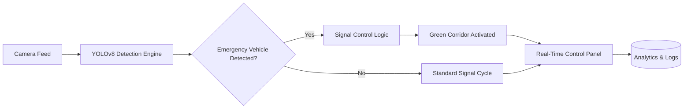
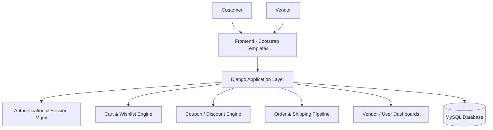
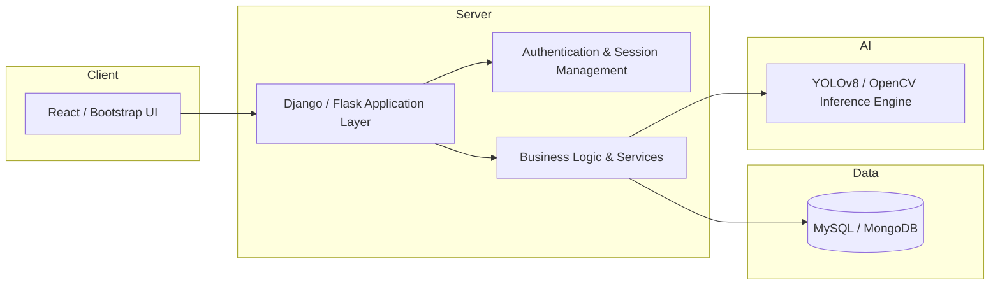
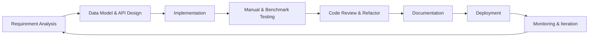
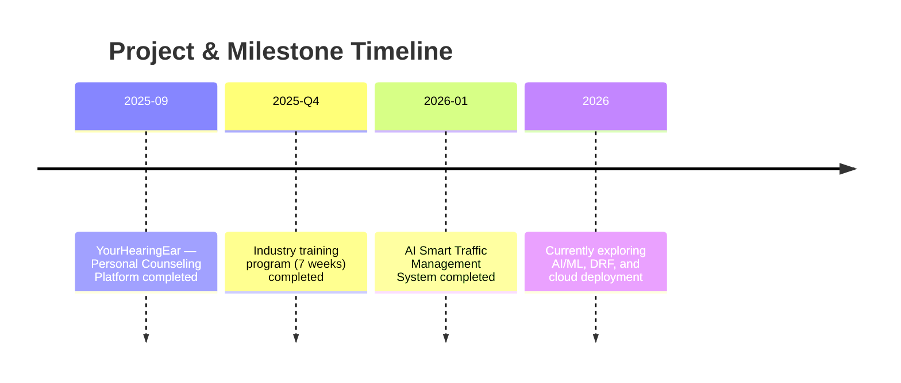

<!-- ==========================================================================
     YOGESHWARI KALASKAR — GITHUB PROFILE README
     Professional Edition
     ========================================================================== -->

<div align="center">


<br/>


<br/><br/>

[](mailto:yogeshwari7887@gmail.com)
[](https://github.com/Yogeshwari7887)
[](#)
[](#connect)


</div>

<br/>


<br/>

## Table of Contents

<div align="center">

| | | | |
|:---:|:---:|:---:|:---:|
| [📇 Profile Summary](#profile-summary) | [🧠 About Me](#about-me) | [🎓 Education](#education) | [🛠️ Technical Skills](#technical-skills) |
| [🚀 Featured Projects](#featured-projects) | [🏗️ Architecture Highlights](#architecture-highlights) | [📊 GitHub Analytics](#github-analytics) | [🧩 Development Approach](#development-approach) |
| [📜 Certifications & Training](#certifications--training) | [🗓️ Activity Timeline](#activity-timeline) | [❓ FAQ](#faq) | [🤝 Connect](#connect) |

</div>


<br/>

<h2 id="profile-summary">📇 Profile Summary</h2>

<div align="center">

<table>
<tr>
<th align="left" width="220">Field</th>
<th align="left">Details</th>
</tr>
<tr><td><b>Full Name</b></td><td>Yogeshwari Sudhakar Kalaskar</td></tr>
<tr><td><b>Role</b></td><td>Full Stack Developer · AI/ML Engineer · Python Developer</td></tr>
<tr><td><b>Education</b></td><td>B.Tech, Information Technology — VIT Pune (CGPA 9.4 / 10, Class of 2028)</td></tr>
<tr><td><b>Location</b></td><td>Pune, Maharashtra, India</td></tr>
<tr><td><b>Email</b></td><td><a href="mailto:yogeshwari7887@gmail.com">yogeshwari7887@gmail.com</a></td></tr>
<tr><td><b>GitHub</b></td><td><a href="https://github.com/Yogeshwari7887">github.com/Yogeshwari7887</a></td></tr>
<tr><td><b>Core Stack</b></td><td>Python · Django · Flask · React · MySQL · MongoDB</td></tr>
<tr><td><b>Specialization</b></td><td>Computer Vision (YOLOv8) · Full-Stack Web Applications</td></tr>
<tr><td><b>Currently Exploring</b></td><td>AI/ML, Django REST Framework, Cloud Deployment</td></tr>
<tr><td><b>Open To</b></td><td>Internships · Freelance Projects · Open-Source Collaboration</td></tr>
</table>

</div>

<br/>

<h2 id="about-me">🧠 About Me</h2>

I am a B.Tech Information Technology student at VIT Pune, maintaining a CGPA of 9.4/10, with a focus on building software that solves real, measurable problems. My work sits at the intersection of full-stack engineering and applied artificial intelligence — from designing relational data models and REST APIs to training and deploying computer-vision models in production-style environments.

I approach engineering with an emphasis on clean architecture, maintainability, and outcomes that can be measured — accuracy, latency, uptime, and user impact — rather than feature count alone. My flagship project, an AI-powered smart traffic management system, reflects this: it combines YOLOv8-based object detection with a real-time control layer to measurably reduce emergency-vehicle response time.

Outside of coursework, I contribute to independent projects spanning e-commerce platforms and social-impact applications, and I am actively expanding into cloud infrastructure and API-first backend design using Django REST Framework.

<table>
<tr>
<td width="50%" valign="top">

**What I focus on**
- Writing readable, well-structured, testable code
- Designing systems that scale gracefully with data and users
- Applying computer vision to real-world constraints (latency, accuracy, hardware)
- Shipping complete, end-to-end products — not just prototypes

</td>
<td width="50%" valign="top">

**How I work**
- Plan the data model and API contract before writing UI code
- Favor explicit, documented logic over clever shortcuts
- Validate AI components with measurable accuracy benchmarks
- Iterate in small, reviewable increments

</td>
</tr>
</table>

<br/>

<h2 id="education">🎓 Education</h2>

<table>
<tr>
<th align="left">Institution</th>
<th align="left">Program</th>
<th align="left">Performance</th>
<th align="left">Timeline</th>
</tr>
<tr>
<td>Vishwakarma Institute of Technology (VIT), Pune</td>
<td>B.Tech, Information Technology</td>
<td>CGPA 9.4 / 10</td>
<td>Class of 2028</td>
</tr>
</table>

<br/>

<h2 id="technical-skills">🛠️ Technical Skills</h2>

<h3>Proficiency Overview</h3>

<table>
<tr><th align="left" width="220">Skill</th><th align="left">Level</th><th align="left" width="120">Rating</th></tr>
<tr><td>Python</td><td></td><td>Advanced</td></tr>
<tr><td>Django</td><td></td><td>Advanced</td></tr>
<tr><td>JavaScript</td><td></td><td>Proficient</td></tr>
<tr><td>React</td><td></td><td>Proficient</td></tr>
<tr><td>MySQL</td><td></td><td>Advanced</td></tr>
<tr><td>Computer Vision (YOLOv8 / OpenCV)</td><td></td><td>Proficient</td></tr>
<tr><td>Flask</td><td></td><td>Proficient</td></tr>
<tr><td>C / C++ / Java</td><td></td><td>Proficient</td></tr>
</table>

<br/>

<h3>Languages</h3>
<p>


</p>

<h3>Frontend</h3>
<p>


</p>

<h3>Backend &amp; Frameworks</h3>
<p>


</p>

<h3>Data Layer</h3>
<p>


</p>

<h3>AI &amp; Computer Vision</h3>
<p>


</p>

<h3>Tools &amp; Platforms</h3>
<p>


</p>

<br/>

<h3>Skill Deep Dive</h3>

<details>
<summary><b>Python</b></summary>
<br/>
Primary language for backend logic, scripting, and AI/ML work. Used across every project in this profile — from Django views and services to YOLOv8 inference pipelines — with an emphasis on readable, PEP 8–compliant code and clear function-level documentation.
</details>

<details>
<summary><b>Django</b></summary>
<br/>
Framework of choice for full-stack web applications. Comfortable designing normalized data models, class-based and function-based views, authentication and session handling, and admin-panel customization for platforms such as GrowPure and YourHearingEar.
</details>

<details>
<summary><b>React</b></summary>
<br/>
Used for building dynamic, component-driven frontends where interactivity matters — such as the live control panel in the AI Smart Traffic Management System. Comfortable with hooks, state management, and integrating REST endpoints.
</details>

<details>
<summary><b>MySQL</b></summary>
<br/>
Primary relational database for production-style projects. Focused on schema normalization, indexing for query performance, and designing relationships that scale cleanly as an application grows (e.g., GrowPure's order, cart, and vendor tables).
</details>

<details>
<summary><b>YOLOv8 &amp; OpenCV</b></summary>
<br/>
Applied for real-time object detection tasks, most notably emergency-vehicle detection in the AI Smart Traffic Management System, achieving 92% detection accuracy. Comfortable with model training, inference optimization, and integrating vision output into downstream control logic.
</details>

<details>
<summary><b>Flask</b></summary>
<br/>
Used for lightweight services and APIs, particularly where a full Django stack isn't necessary — such as serving inference results from the traffic-detection model to the control panel in real time.
</details>

<br/>


<h2 id="featured-projects">🚀 Featured Projects</h2>

<br/>

### 01 · AI Smart Traffic Management System

<table>
<tr><td>


</td></tr>
</table>

**Overview**
An intelligent traffic control system that uses real-time computer vision to detect emergency vehicles and dynamically create green corridors, reducing response times for ambulances and fire trucks.

**Problem Statement**
Emergency vehicles routinely get delayed at signal-controlled intersections because legacy traffic systems operate on fixed timers and cannot react to real-world conditions. Every minute of delay directly affects patient outcomes in medical emergencies.

**Solution**
The system uses a YOLOv8-based detection pipeline to identify emergency vehicles from live camera feeds, then communicates with a signal-control layer to clear a path through the intersection in real time, with a web-based control panel for monitoring and manual override.

<details>
<summary><b>System Architecture (click to expand)</b></summary>


```mermaid
flowchart LR
    A[Camera Feed] --> B[YOLOv8 Detection Engine]
    B --> C{Emergency Vehicle Detected?}
    C -- Yes --> D[Signal Control Logic]
    C -- No --> E[Standard Signal Cycle]
    D --> F[Green Corridor Activated]
    F --> G[Real-Time Control Panel]
    E --> G
    G --> H[(Analytics & Logs)]
```

</details>

<details>
<summary><b>Key Features (click to expand)</b></summary>

| Feature | Description |
|---|---|
| Real-time detection | YOLOv8 model processes live video to identify emergency vehicles |
| Dynamic signal control | Signals adjust automatically to open a corridor for detected vehicles |
| Control room dashboard | Live web panel for monitoring detections and intersection status |
| Intersection syncing | Automatic coordination across multiple connected signals |
| Confidence scoring | Each detection is reported with a model confidence score |

</details>

**Impact Metrics**

<div align="center">

| Metric | Result |
|:---|:---:|
| Vehicle Detection Accuracy | **92%** |
| Emergency Response Time Improvement | **~40% faster** |
| Monitoring | Real-time analytics dashboard |
| Signal Coordination | Automated, multi-intersection |

</div>

**Tech Stack**
<p>


</p>

<details>
<summary><b>Challenges &amp; Solutions (click to expand)</b></summary>

| Challenge | Solution |
|---|---|
| False positives from visually similar vehicles | Fine-tuned the YOLOv8 model on a curated, domain-specific training set of emergency vehicles |
| Latency between detection and signal response | Optimized the inference pipeline to run detection and signal logic asynchronously |
| Coordinating multiple intersections in real time | Introduced a centralized control-panel service to synchronize state across signals |

</details>

<details>
<summary><b>Future Enhancements (click to expand)</b></summary>

- Extend detection to additional vehicle classes and adverse weather conditions
- Add historical analytics for long-term traffic-pattern insights
- Integrate with municipal traffic-management APIs for broader deployment

</details>

<br/>

---

### 02 · GrowPure — Organic E-Commerce Platform

<table>
<tr><td>


</td></tr>
</table>

**Overview**
A complete e-commerce platform for organic products, built with Django and MySQL, covering the full customer purchase journey and vendor-side operations.

**Problem Statement**
Small organic-goods sellers often lack an affordable, full-featured e-commerce platform that supports both customer-facing shopping experiences and vendor management tools in one system.

**Solution**
GrowPure delivers a Django-based platform with secure authentication, cart and wishlist management, a coupon engine, and dual dashboards for customers and vendors — with order tracking and sales analytics built in.

<details>
<summary><b>System Architecture (click to expand)</b></summary>


```mermaid
flowchart TB
    U[Customer] --> FE[Frontend - Bootstrap Templates]
    V[Vendor] --> FE
    FE --> APP[Django Application Layer]
    APP --> AUTH[Authentication & Session Mgmt]
    APP --> CART[Cart & Wishlist Engine]
    APP --> COUPON[Coupon / Discount Engine]
    APP --> ORDER[Order & Shipping Pipeline]
    APP --> DASH[Vendor / User Dashboards]
    APP --> DB[(MySQL Database)]
```

</details>

<details>
<summary><b>Key Features (click to expand)</b></summary>

| Module | Capabilities |
|---|---|
| Authentication | Secure login/signup with session and CSRF protection |
| Shopping | Cart management, personalized wishlists, product search & filters |
| Promotions | Dynamic coupon and discount engine |
| Fulfillment | Order tracking and shipping pipelines |
| Dashboards | Separate views for customer and vendor roles |
| Analytics | Sales reporting for vendors |
| Responsiveness | Mobile-first layout across all pages |

</details>

**Platform Snapshot**

<div align="center">

| Metric | Value |
|:---|:---:|
| Orders Processed | 247 |
| Registered Users | 1,394 |
| Active Coupons | 18 |
| Revenue Tracked | ₹92,400 |
| Active Cart Sessions | 83 |
| Wishlist Entries | 512 |

</div>

**Tech Stack**
<p>


</p>

<details>
<summary><b>Challenges &amp; Solutions (click to expand)</b></summary>

| Challenge | Solution |
|---|---|
| Keeping cart and wishlist state consistent across sessions | Implemented server-side session management with secure cookies |
| Preventing coupon abuse | Added validation rules and usage limits within the discount engine |
| Supporting two very different user types (customer vs. vendor) | Built role-based dual dashboards with separated permissions |

</details>

<details>
<summary><b>Future Enhancements (click to expand)</b></summary>

- Integrate a payment gateway for end-to-end checkout
- Add a recommendation engine based on browsing and purchase history
- Migrate reporting to a dedicated analytics dashboard with export options

</details>

<br/>

---

### 03 · YourHearingEar — Personal Counseling Platform

<table>
<tr><td>


</td></tr>
</table>

**Overview**
A digital counseling platform designed to give users a safe, private space to seek support, built around ethical design and trust-first UX principles.

**Problem Statement**
Many people avoid seeking support because existing platforms feel impersonal or raise privacy concerns. There's a need for a respectful, low-friction digital space that prioritizes user trust from the first interaction.

**Solution**
The platform provides structured guidance modules and support frameworks with an interface designed around privacy, inclusivity, and trust-building — avoiding manipulative or attention-driven design patterns.

<details>
<summary><b>Key Features (click to expand)</b></summary>

| Feature | Description |
|---|---|
| Guidance Modules | Structured pathways for different support needs |
| Support Frameworks | Consistent, predictable interaction patterns to build trust |
| Inclusive Design | Interface accessible to a broad range of users |
| Ethical Interactions | No dark patterns; transparent data use |
| Privacy-First Data | Minimal data collection with a privacy-first architecture |

</details>

**Tech Stack**
<p>


</p>

<details>
<summary><b>Design Considerations (click to expand)</b></summary>

| Consideration | Approach |
|---|---|
| User trust from first interaction | Kept onboarding minimal and transparent about data usage |
| Sensitive subject matter | Avoided engagement-driven UX patterns in favor of calm, predictable flows |
| Data privacy | Limited data collection strictly to what's operationally necessary |

</details>

<details>
<summary><b>Future Enhancements (click to expand)</b></summary>

- Add optional multilingual support for wider accessibility
- Introduce anonymized usage analytics to guide UX improvements without compromising privacy
- Expand guidance modules based on user feedback

</details>

<br/>

### Project Comparison

<div align="center">

| Project | Category | Core Stack | Status | Completed |
|---|---|---|:---:|:---:|
| AI Smart Traffic Management System | Computer Vision / IoT | Python, YOLOv8, Flask, React | ✅ Completed | Jan 2026 |
| GrowPure | Full-Stack E-Commerce | Django, MySQL, Bootstrap | ✅ Production Grade | — |
| YourHearingEar | Social Impact / Ethical UX | Django, Python, JavaScript | ✅ Completed | Sep 2025 |

</div>

<br/>


<h2 id="architecture-highlights">🏗️ Architecture Highlights</h2>

A representative view of how projects in this profile are typically structured — favoring clear separation of concerns between the presentation layer, application logic, and data layer.


```mermaid
flowchart LR
    subgraph Client
        A[React / Bootstrap UI]
    end
    subgraph Server
        B[Django / Flask Application Layer]
        C[Authentication & Session Management]
        D[Business Logic & Services]
    end
    subgraph Data
        E[(MySQL / MongoDB)]
    end
    subgraph AI
        F[YOLOv8 / OpenCV Inference Engine]
    end

    A --> B
    B --> C
    B --> D
    D --> E
    D --> F
```

**Design principles applied across projects**

| Principle | How it's applied |
|---|---|
| Separation of concerns | UI, business logic, and data access are kept in distinct layers |
| Security by default | CSRF protection, secure sessions, and input validation on all forms |
| Measurable outcomes | AI components are validated against accuracy/latency benchmarks, not just "working demos" |
| Responsive design | All customer-facing interfaces are mobile-first |
| Maintainable data models | Schemas are normalized and documented before implementation begins |

<br/>


<h2 id="github-analytics">📊 GitHub Analytics</h2>

<div align="center">


<br/><br/>


<br/><br/>


<br/><br/>


<br/><br/>


<br/><br/>


<br/><br/>


</div>

<br/>

<h3>Contribution Snake</h3>

<div align="center">

<picture>
  <source media="(prefers-color-scheme: dark)" srcset="https://raw.githubusercontent.com/Yogeshwari7887/Yogeshwari7887/output/github-snake-dark.svg"/>
  <source media="(prefers-color-scheme: light)" srcset="https://raw.githubusercontent.com/Yogeshwari7887/Yogeshwari7887/output/github-snake.svg"/>
  
</picture>

<sub>To activate this animation, add the <a href="https://github.com/Platane/snk">Platane/snk</a> GitHub Action as <code>.github/workflows/snake.yml</code> in this repository.</sub>

</div>

<br/>


<h2 id="development-approach">🧩 Development Approach</h2>

<table>
<tr><th align="left" width="240">Stage</th><th align="left">Practice</th></tr>
<tr><td><b>Planning</b></td><td>Define data models and API contracts before writing UI code; break work into small, trackable tasks</td></tr>
<tr><td><b>Development</b></td><td>Write modular, documented code with consistent naming and clear commit history</td></tr>
<tr><td><b>Testing</b></td><td>Validate functionality manually and, for AI components, against measurable accuracy benchmarks</td></tr>
<tr><td><b>Review</b></td><td>Refactor for readability and performance before considering a feature complete</td></tr>
<tr><td><b>Deployment</b></td><td>Document setup and environment requirements clearly for reproducibility</td></tr>
</table>

<br/>

<h3>Typical Workflow</h3>


```mermaid
flowchart LR
    A[Requirement Analysis] --> B[Data Model & API Design]
    B --> C[Implementation]
    C --> D[Manual & Benchmark Testing]
    D --> E[Code Review & Refactor]
    E --> F[Documentation]
    F --> G[Deployment]
    G --> H[Monitoring & Iteration]
    H --> A
```

<h3>Code Quality Checklist</h3>

<table>
<tr><th align="left">Check</th><th align="left">Applied To</th></tr>
<tr><td>Consistent naming conventions</td><td>All projects</td></tr>
<tr><td>Input validation on all forms and endpoints</td><td>Django / Flask applications</td></tr>
<tr><td>CSRF and session security</td><td>GrowPure, YourHearingEar</td></tr>
<tr><td>Model accuracy benchmarking</td><td>AI Smart Traffic Management System</td></tr>
<tr><td>Mobile-first responsive layout</td><td>All customer-facing interfaces</td></tr>
<tr><td>Documented setup instructions</td><td>All repositories</td></tr>
</table>

<br/>

<h3>Repository Structure (Representative Example)</h3>

```text
project-root/
├── backend/
│   ├── app/
│   │   ├── models.py
│   │   ├── views.py
│   │   ├── serializers.py
│   │   └── services/
│   ├── config/
│   │   └── settings.py
│   └── requirements.txt
├── frontend/
│   ├── src/
│   │   ├── components/
│   │   ├── pages/
│   │   └── App.jsx
│   └── package.json
├── ml/
│   ├── training/
│   ├── inference/
│   └── models/
├── docs/
│   └── architecture.md
└── README.md
```

<br/>


<h2 id="certifications--training">📜 Certifications & Training</h2>

<table>
<tr><th align="left">Program</th><th align="left">Focus Area</th><th align="left">Duration</th></tr>
<tr><td>Industry Training Program</td><td>Applied software development practices</td><td>7 Weeks</td></tr>
</table>

<sub>Additional certifications and coursework will be listed here as they are completed.</sub>

<br/>


<h2 id="activity-timeline">🗓️ Activity Timeline</h2>


```mermaid
timeline
    title Project & Milestone Timeline
    2025-09 : YourHearingEar — Personal Counseling Platform completed
    2025-Q4 : Industry training program (7 weeks) completed
    2026-01 : AI Smart Traffic Management System completed
    2026    : Currently exploring AI/ML, DRF, and cloud deployment
```

<br/>


<h2 id="faq">❓ Frequently Asked Questions</h2>

<details>
<summary><b>What kind of roles or projects are you looking for?</b></summary>
<br/>
I'm primarily interested in internships and freelance projects involving full-stack web development or applied AI/computer vision, as well as open-source collaboration in those areas.
</details>

<details>
<summary><b>What's your primary tech stack?</b></summary>
<br/>
Python and Django form the backbone of my backend work, paired with MySQL for relational data. On the frontend, I use React or Bootstrap depending on project needs. For computer vision work, I use YOLOv8 and OpenCV.
</details>

<details>
<summary><b>Are you available for freelance or contract work?</b></summary>
<br/>
Yes — I'm open to freelance projects, particularly those involving full-stack development or computer vision applications. Reach out via email to discuss scope and timelines.
</details>

<details>
<summary><b>Do you contribute to open source?</b></summary>
<br/>
I'm actively looking to increase my open-source contributions and welcome suggestions for beginner-friendly projects in Python, Django, or computer vision.
</details>

<br/>


<h2 id="connect">🤝 Connect With Me</h2>

<div align="center">

I'm open to internships, freelance projects, collaborations, open-source contributions, and hackathons. Feel free to reach out.

<br/><br/>

[](mailto:yogeshwari7887@gmail.com)
[](https://github.com/Yogeshwari7887)

<br/><br/>


<br/><br/>


<br/><br/>


</div>

<!-- ==========================================================================
     END OF README — YOGESHWARI KALASKAR
     ========================================================================== -->
